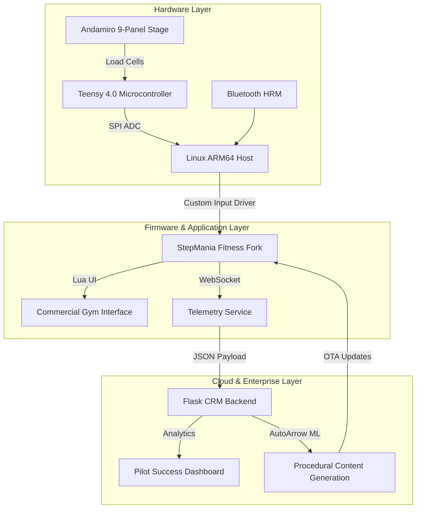
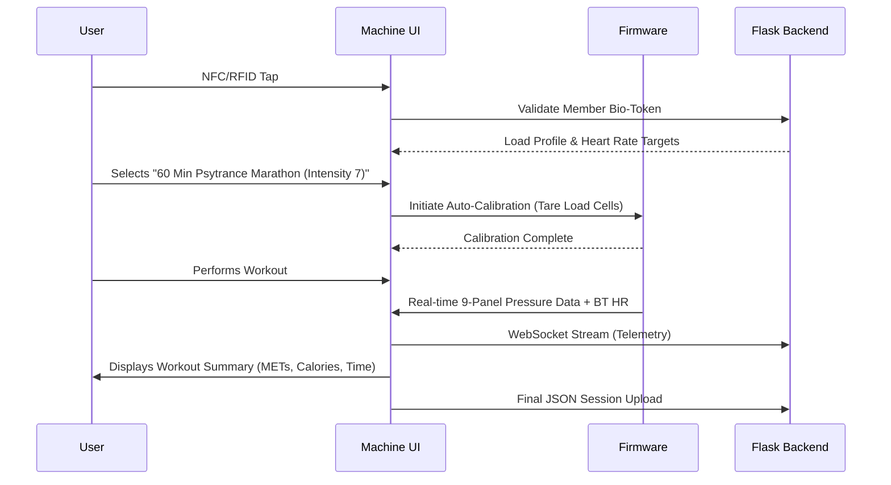

# Architecture: Custom 9-Panel Fitness Platform

## 1. Strategic Rationale
This architecture merges our "Rogue Franchise Loophole" (Path A) with a direct "Corporate Vendor Pipeline" (Path B). We are moving from retrofitting existing 4-panel/5-panel commercial kiosks to engineering a proprietary 9-panel matrix manufactured by Andamiro.
- **Why 9-Panel?** Biomechanical analysis indicates a 3x3 grid allows for a wider variety of lateral, diagonal, and core-stabilizing movements compared to standard cross (4-panel) or X (5-panel) layouts, maximizing HIIT potential.
- **Why Andamiro?** They possess the tooling and supply chain for heavy-duty exergaming stages but are open to experimental partnerships.
- **Why Fork StepMania?** Reusing the open-source engine handles the complex timing, audio syncing, and note charting logic, allowing us to focus purely on the custom C++ input driver and the commercial fitness UI.

## 2. Full System Block Diagram

## 3. Session Lifecycle Sequence

## 4. Key Interface Contracts
- **Machine ↔ Backend:** Secure WebSocket over TLS. JSON payloads must include `franchise_id`, `equipment_id`, `nfc_uid`, `duration_minutes`, `avg_hr`, and `met_score`.
- **Backend ↔ ML Feedback Loop:** The server analyzes completion rates and heart-rate variability to auto-calibrate difficulty limits for the user's next session.

## 5. Critical Design Decisions
- **Load Cells vs. Microswitches:** Load cells are selected for durability under heavy adult use and to provide granular force data (allowing for MET estimation), whereas switches only provide binary input.
- **Server-Side ML vs. On-Device:** "AutoArrow" chart generation occurs server-side to protect IP and conserve machine edge-compute power; charts are pushed OTA.
- **Linux + Openbox vs. Windows:** A bare-metal Linux X11 environment ensures maximum stability, zero license costs, and eliminates arcade OS overhead.

## 6. Open Questions & Risks
- **Andamiro MOQ:** Will they accept a 500-unit commitment based purely on regional pilot data?
- **Certification:** The timeline and cost for UL, CE, and ADA compliance for a custom cabinet.
- **HRM Latency:** Ensuring Bluetooth HR monitors sync flawlessly in an environment with high RF interference (gym floors).
