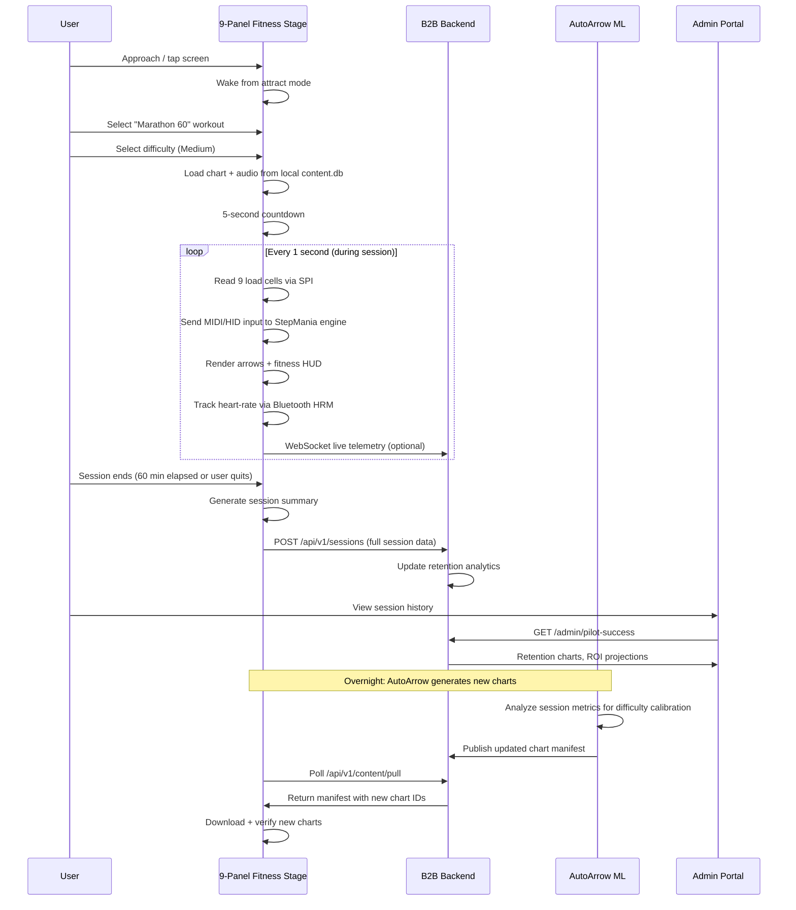

# Custom 9-Panel Fitness Platform — System Architecture & Design

**Phase:** Strategic Initiative v9.0 — Vertical Integration
**Status:** Design Draft
**Last Updated:** 2026-06-22

---

## 1. Problem Statement

The existing project architecture targets regional Planet Fitness franchise groups with off-the-shelf StepManiaX hardware and a zero-risk pilot framework. While viable as an entry strategy, this approach has three structural limitations:

1. **Hardware dependence:** Relies on Step Revolution's SMX kiosk, which is an arcade product repurposed for fitness — not optimized for 60+ minute cardio sessions, heart-rate integration, or commercial gym aesthetics.
2. **Software constraints:** SMX's proprietary OS cannot be customized with a fitness-first UI, telemetry pipeline, or ML-driven content delivery without manufacturer cooperation.
3. **Content ceiling:** Even with AutoArrow ML, the 4-panel layout limits movement variety and long-duration biomechanical optimization.

This design document addresses a parallel path: **vertically integrated custom hardware + software + content**, purpose-built for commercial fitness from the ground up.

---

## 2. System Architecture

### 2.1 High-Level Block Diagram

```mermaid
graph TB
    subgraph "Hardware Layer"
        A[9-Panel Stage<br/>3×3 Load Cell Matrix]
        B[LED Panel Array<br/>Addressable RGB]
        C[24\" Touchscreen<br/>Anti-Glare]
        D[SBC<br/>RK3588 / CM5]
        E[Audio<br/>Speaker Bar + HP Jack]
    end

    subgraph "Firmware / OS Layer"
        F[Linux Minimal<br/>Ubuntu Server 24.04]
        G[9-Panel ADC Driver<br/>SPI + MCP3008]
        H[Wayland Compositor<br/>Weston / Kiosk Mode]
    end

    subgraph "Application Layer"
        I[StepMania Engine<br/>Patched for 9-panel]
        J[Fitness UI Theme<br/>Qt QML]
        K[Telemetry Client<br/>Session Upload]
        L[OTA Updater<br/>Content + Firmware]
    end

    subgraph "Cloud / Backend Layer"
        M[Content API<br/>Chart Delivery]
        N[Session Ingestion<br/>Telemetry Pipeline]
        O[Analytics Dashboard<br/>Retention Metrics]
        P[AutoArrow ML<br/>Chart Generation]
    end

    subgraph "Enterprise Layer"
        Q[B2B Admin Portal<br/>Existing Flask App]
        R[Lead CRM + Pipeline<br/>Existing SQLite/Flask]
        S[Reporting Engine<br/>Pilot Success Dashboard]
    end

    A -->|SPI ADC| F
    B -->|SPI GPIO| F
    C -->|HDMI + USB| F
    D --> F
    E -->|I2S / USB| F
    
    F --> G
    F --> H
    H --> I
    I --> J
    I --> K
    I --> L
    
    K -->|HTTPS POST| N
    L -->|HTTPS GET| M
    M --> P
    N --> O
    O --> Q
    Q --> R
    Q --> S
```

### 2.2 Data Flow — Session Lifecycle



---

## 3. Strategic Rationale

### 3.1 Why 9 Panels?

The 3×3 grid is biomechanically superior to both 4-panel (DDR/SMX) and 5-panel (PIU) layouts for sustained cardio:

| Layout | Panels | Movement Variety | Low-Impact Options | Diagonal Range | Learning Curve |
|--------|--------|-----------------|--------------------|-----------------|----------------|
| 4-panel (DDR) | 4 | Low | Moderate | None | Flat |
| 5-panel (PIU) | 5 | Moderate | High | Restricted | Steep |
| **9-panel (Custom)** | **9** | **High** | **Very High** | **Full** | **Gradual (progressive panel unlock)** |

Key insight: A 9-panel layout allows **progressive difficulty via panel unlock** — Beginner uses only center + 4 cardinal, Medium adds diagonals, Hard+Challenge uses all 9. This means a single physical machine serves all fitness levels without compromising the experience at either end.

### 3.2 Why Andamiro?

Andamiro is the only major rhythm hardware manufacturer with:
- Existing relationship with Korean PCB/sensor supply chains (cost advantage over US-based fabrication)
- Demonstrated willingness to deviate from standard form factors (PIU's 5-panel was itself a deviation from DDR's 4-panel)
- No existing contract or exclusivity with Planet Fitness (unlike Life Fitness/Matrix at corporate level)
- Manufacturing capacity for runs of 100-5,000 units

### 3.3 Why StepMania (Fork) vs. Building From Scratch?

| Approach | Dev Time | Chart Compatibility | Audio Sync | Rendering | Maintenance |
|----------|----------|---------------------|------------|-----------|-------------|
| Build from scratch | 18-24 months | None (new format) | Must implement | Must implement | Full team |
| Fork StepMania | 3-4 months | Full .ssc/.sm compat | Battle-tested | Battle-tested | ~5k lines of custom code |
| Fork StepManiaX (proprietary) | N/A | Not possible | N/A | N/A | Legal risk |

StepMania has 20+ years of optimization for real-time audio-synchronized arrow rendering, input latency compensation, and chart parsing. Building equivalent quality from scratch is ~$500K+ in engineering cost.

---

## 4. Interface Contracts

### 4.1 Machine → Backend (Telemetry)

Every session uploads a JSON payload (see `technical_docs/stepmania_fitness_fork_spec.md` §6.1 for full schema). Key fields:

```
session_id, machine_id, club_id, duration, difficulty, steps,
avg_met, avg_heart_rate, time_in_zones: {zone_1..zone_5},
calories_burned, panel_usage: {center..down_right}, chart_id
```

### 4.2 Backend → Machine (Content Delivery)

```
GET /api/v1/content/pull
  → {
      manifest_version: 12,
      charts: [
        { id: "autoarrow-psyt-012", difficulty: "medium",
          duration: 3600, ssc_url: "...", audio_url: "...",
          checksum_sha256: "abc123..." }
      ],
      deprecated_charts: ["autoarrow-psyt-001"],
      force_update: false
    }
```

### 4.3 Machine → AutoArrow ML (Feedback Loop)

```
Machine aggregates weekly session stats:
  {
    machine_id, week_start,
    sessions_by_difficulty: { beginner: 12, medium: 47, ... },
    avg_retention_rate: 0.83,   // % of users who completed 80%+ of session
    avg_completion_rate: 0.91,  // % of started sessions completed
    difficulty_curve_feedback: {
      medium: { too_easy: 0.05, too_hard: 0.08, just_right: 0.87 }
    }
  }

→ AutoArrow adjusts future chart generation:
  - If completion_rate < 0.7 for a difficulty → reduce pattern density by 10%
  - If just_right > 0.9 for a difficulty → add intermediate sub-level
  - If certain panel combinations show >2x avg missed count → flag for manual review
```

---

## 5. Integration With Existing Project

### 5.1 What Reuses

| Existing Asset | How It Fits |
|----------------|-------------|
| `autoarrow_proto.py` | Chart generation algorithm (extended for 9-panel output) |
| `app.py` (Flask admin) | Admin portal, CRM, pipeline, reporting (adds machine management + hardware fleet views) |
| `analytics.py` | ROI calculations, retention projections (adds machine telemetry as data source) |
| `launch_outreach.py` | Outreach engine for Andamiro partnership + Planet Fitness corporate engagement |
| `pilot-mou.md` | Modified for hardware pilot terms |
| `outreach/manufacturer_letters.md` | Existing Andamiro letter is superseded by `andamiro_custom_hardware_proposal.md` |
| `technical_docs/autoarrow_ml_specs.md` | ML architecture remains valid; output extended for 9-panel format |

### 5.2 What Changes

| Asset | Change |
|-------|--------|
| `VISION.md` | ✅ Updated — two-path model (regional + corporate) |
| `ROADMAP.md` | **Needs update** — add Phase 14: Custom Hardware |
| `TODO.md` | **Needs update** — add implementation tasks |
| `HANDOFF.md` | **Will update** after this session |
| `pitch-deck.md` | New version: corporate-focused, custom hardware angle |

---

## 6. Key Design Decisions

### 6.1 Load Cell vs. Switch Sensors

**Decision: Industrial load cells** over mechanical microswitches.

- Microswitches (standard in arcade machines): ~100K cycle life, binary on/off, no pressure data
- Load cells: 500K+ cycle MTBF, analog pressure sensing enables MET estimation and gait analysis
- Cost delta: ~$15/panel vs. ~$2/switch → $117 vs. $18 per machine. Worth it for fitness data.

### 6.2 Server-Side ML vs. On-Device ML

**Decision: Server-side chart generation, on-device playback.**

- ML inference (even optimized) requires GPU or NPU → adds $50-100/BOM per unit
- Chart generation is offline-able; batch generation overnight serves all machines
- On-device only needs: load chart → render → accept input → upload telemetry
- No internet dependency for core gameplay; content updates are opportunistic

### 6.3 Linux SBC vs. Windows IoT

**Decision: Linux SBC (Rockchip/Raspberry Pi).**

- Windows IoT license: ~$30-50/unit
- Linux: $0
- StepMania compiles natively on Linux (already proven)
- Real-time audio performance on Linux with ALSA + RT kernel matches Windows WASAPI
- Remote management (SSH, systemd, OTA) is simpler on Linux

### 6.4 Qt QML vs. HTML5 WebView for UI

**Decision: Qt QML for now, with HTML5 fallback considered.**

- Qt QML: hardware-accelerated, native performance, direct integration with StepMania's rendering loop
- HTML5 WebView: easier theming and iteration, but adds Chrome/WebKit memory overhead (~200MB) on SBC
- Hybrid approach: Core screens (QML), content/marketing screens (optional WebView embedded)

---

## 7. Open Questions

| Question | Status | Needs Input From |
|----------|--------|------------------|
| Andamiro MOQ for custom 9-panel tooling | Unknown | Andamiro engineering review |
| Planet Fitness corporate procurement cycle | Unknown | Industry contacts / franchise council |
| UL/ADA certification cost for new hardware category | TBD (~$50-100K est.) | Compliance consultant |
| 9-panel StepMania chart authoring tools | Unstarted | AutoArrow team |
| Heart-rate sensor mandatory vs. optional | Design choice | Gym operator feedback |
| Price point acceptability ($6K vs. $8K+) | Unknown | Pilot location feedback |

---

## 8. Success Metrics

| Metric | Target | Measurement |
|--------|--------|-------------|
| Hardware prototype functional | 5 units | Andamiro pilot batch passes factory QA |
| Software stability (60-min session) | 0 crashes per 100 sessions | Uptime telemetry |
| Session completion rate | >80% | Telemetry: completed / started |
| Average session duration | >45 min | Telemetry |
| Heart-rate zone accuracy | ±5 bpm vs. chest strap | Validation testing |
| Content generation throughput | 10 new charts/day | AutoArrow pipeline |
| Fitness UI usability score | >85/100 | User testing (SUS score) |

---

## 9. Related Documents

- `VISION.md` — Strategic vision (updated with two-path model)
- `outreach/andamiro_custom_hardware_proposal.md` — Hardware partnership proposal
- `technical_docs/stepmania_fitness_fork_spec.md` — Software architecture & driver spec
- `technical_docs/autoarrow_ml_specs.md` — ML engine specification
- `technical_docs/flow_state_analytics.md` — Metabolic research backing the fitness claims
- `GOVERNANCE.md` — Autonomous development protocol
